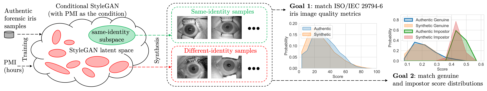

# Forensic Iris Image Synthesis

## Proceedings of the IEEE/CVF Winter Conference on Applications of Computer Vision (WACV) 2024

### [Paper](https://wacv2024.thecvf.com/)

<figure>
  
  <figcaption>Figure 1: Synthesis of PMI-conditioned same- and different-identity forensic iris images, with a desired iris image quality (controlled by matching the ISO quality metrics), and with the desired genuine/impostor score distributions (mimicking score distributions obtained for authentic forensic samples).</figcaption> 

## Obtaining the Offered Synthesis Dataset
To access the forensic iris synthesis dataset offered with this paper, you can request a copy from the [University of Notre Dame Computer Vision Research Lab](https://cvrl.nd.edu/projects/data). The specific collection related to this work is titled "UND WACV 2024 Forensic Iris Synthesis Dataset."

## Obtaining the Trained Model Weights
To access the trained model weights offered with this paper, you can request a copy from the [University of Notre Dame Computer Vision Research Lab](https://cvrl.nd.edu/projects/data). The specific collection related to this work is titled "network-snapshot-025000.pkl".

## Contents
- **Training Dataset Preparation:**
  - Code: stylegan2-ada-pytorch-code/dataset_tool.py
  - *Note: To prepare the conditional training dataset, ensure you have a JSON file containing filenames and their corresponding labels. An example JSON file is available in training-dataset/dataset.json.*

## Installation
Install dependencies using Conda:

``
conda env create -f environment.yml
``

- **Training:**
  - Code: stylegan2-ada-pytorch-code/train.py

- **Synthesis Image Generation:**
  - Code: stylegan2-ada-pytorch-code/generate.py
  - *Note: If you want to adjust the noise intensity while generating synthesis images, you can change it by modifying line number 122.*

## To Run
1.) Run the following bash script to prepare the training dataset and train the model:

``
./train.sh
``

2.) Run the following bash script to generate synthesis images with different noise intensities:

``
./generate.sh
``

***Note: Make sure you have provided all the valid paths in the script.***

## Citation
Please cite our paper if you use any part of our code or data.
```
@inproceedings{bhuiyan2024forensic,
  title={Forensic Iris Image Synthesis},
  author={Bhuiyan, Rasel Ahmed and Czajka, Adam},
  booktitle={Proceedings of the IEEE/CVF Winter Conference on Applications of Computer Vision (WACV)},
  year={2024},
}
